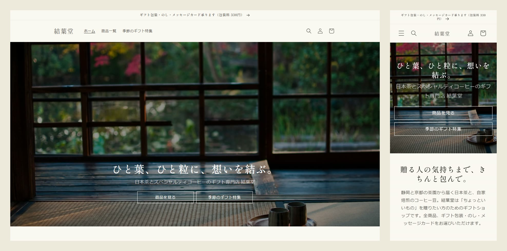
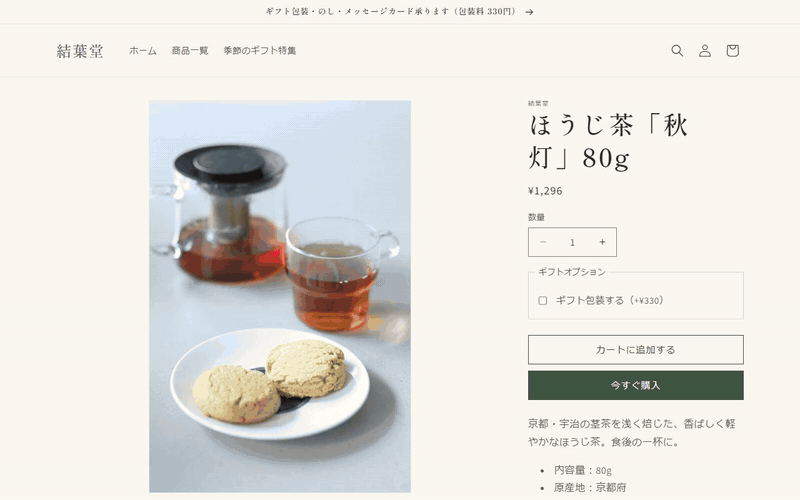
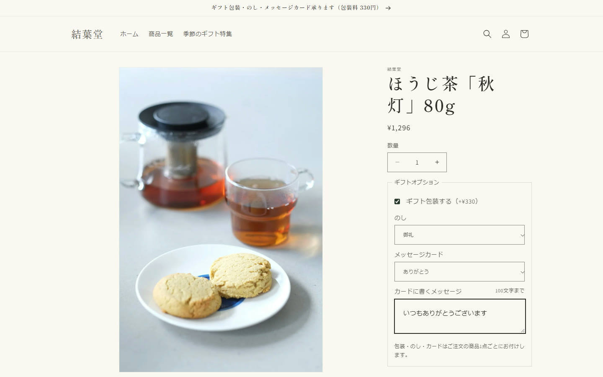
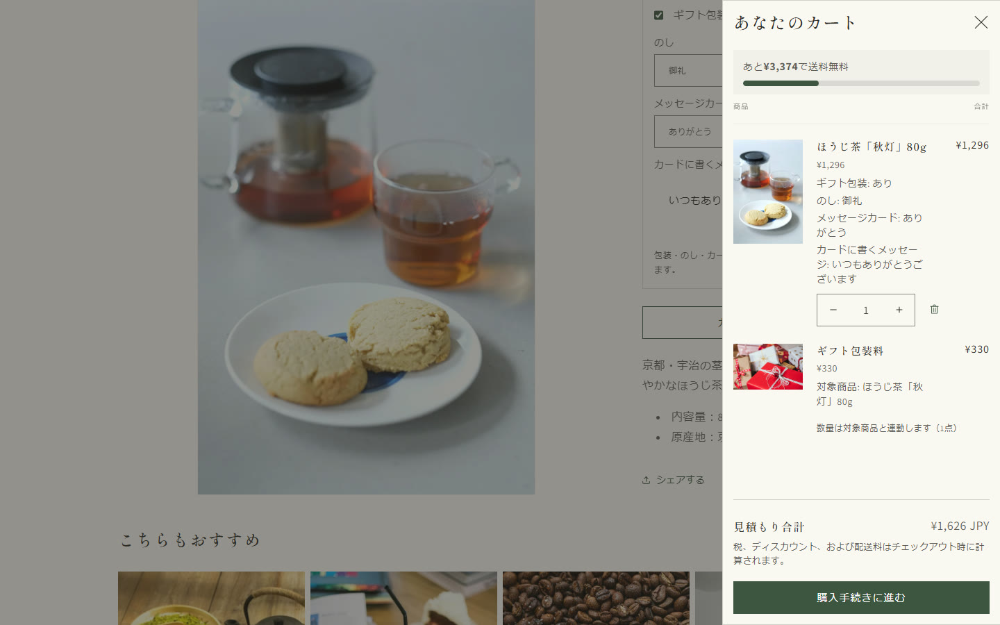
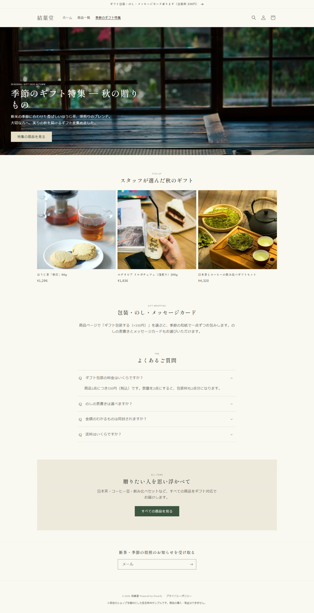

# 結葉堂（ゆいはどう）― Shopify テーマのカスタマイズ

架空のお茶とコーヒー豆のギフトショップ「結葉堂」を題材にした、**Shopify テーマ（Dawn）のカスタマイズ**の自主制作サンプルです。
Shopify の修正・機能追加の案件でよく求められる作業（商品オプションの追加、オーナーが自分で変えられる設定、表示位置の変更、特集ページ、カートの改善）を、**アプリを使わずテーマのコードだけで**実装しました。

> ※架空のショップを題材にした自主制作サンプルです。実在の店舗・商品とは関係ありません。
> 開発ストアはパスワード付きのため一般公開していません。閲覧をご希望の場合は、応募時にご案内します。



## カスタマイズの一覧

| # | 内容 | 主なファイル |
|---|---|---|
| 1 | **ギフトオプション**：ギフト包装（+330円）・のし・メッセージカード。カートページとカートドロワーに表示し、包装料は本体と数量・削除が連動 | `snippets/gift-options.liquid`、`assets/gift-options.js`、`snippets/gift-wrap-sync.liquid` |
| 2 | **オーナーが自分で変えられる見出し設定**：日本語フォント・太さ・スマートフォンでの大きさ・文字間隔・色をテーマエディタで変更 | `config/settings_schema.json`、`snippets/heading-styles.liquid` |
| 3 | **言語・通貨の切り替えの表示位置**：ヘッダー右上／フッター／両方をテーマエディタで選択 | `sections/header.liquid`、`sections/footer.liquid` |
| 4 | **特集ページ（LP）用セクション**：メインビジュアル・商品ピックアップ・FAQ（アコーディオン）・CTA・テキストをブロックで自由に並べ替え | `sections/gift-feature.liquid`、`templates/page.gift-feature.json` |
| 5 | **送料無料までの残り金額バー**：「あと○円で送料無料」。基準額はテーマエディタで設定（通貨ごとにも設定可） | `snippets/free-shipping-bar.liquid` |

### ギフトオプションの動作

ギフト包装・のし・メッセージカードを選んでカートに追加 → ドロワーで数量を 2 にすると包装料も 2 に → 削除すると包装料も一緒に消える（[MP4](docs/images/gift-options.mp4)）



### スクリーンショット

| 商品ページ（ギフトオプション） | カートドロワー（包装料の連動・送料無料バー） | 特集ページ |
|---|---|---|
|  |  |  |

## ドキュメント

- [オーナー向け手順メモ（コードを触らずに変えられる設定）](docs/owner-guide.md)：実際の案件でも納品物として渡す想定の形式
- [カート・チェックアウトに進めない不具合の調査手順](docs/troubleshooting-cart-checkout.md)：アプリとテーマの切り分け方、開発者ツールで見る箇所、本番テーマを触らない検証と戻し方
- [ギフトオプションの実装手順](docs/gift-option-implementation.md)：他のストアに同じ機能を入れるときの手順と確認項目
- [環境の準備と開発ストアの設定](docs/setup.md)

## 使用技術

- **Liquid**（セクション・スニペット・schema の設定）
- **JSON テンプレート**（Online Store 2.0。`templates/*.json`、`sections/*-group.json`）
- **バニラ JavaScript**（Custom Elements、Cart Ajax API：`/cart/add.js`・`/cart/update.js`・`/cart/change.js`、Section Rendering API）
- **CSS**（Dawn の CSS 変数と配色スキームに合わせて追加）
- **Shopify CLI**（`shopify theme dev`／`push`／`check`）
- ベーステーマ：[Dawn](https://github.com/Shopify/dawn) 16.0.0
- GitHub Actions で push のたびに Theme Check を実行

## 工夫した点

### アプリを使わない実装

ギフト系のアプリは月額費用がかかるうえ、カートの不具合の原因になりやすいため、テーマのコードだけで実装しました。

- のし・メッセージカードは **line item properties** として本体の行に付け、注文管理画面やメールにもそのまま表示されます
- 包装料は「ギフト包装料」という別商品にし、本体と**1 回のリクエストで同時に**カートへ入れます（片方だけ入る状態を作らない）
- Dawn のファイルへの変更は最小限にしました。`product-form.js` と `cart.js` は数行のフックだけで、処理の本体は追加したファイル（`assets/gift-options.js`）にまとめています。Dawn の更新を取り込むときに差分を追いやすくするためです

### 包装料の連動

「包装料だけがカートに残る」「本体と包装料の数量がずれる」を、次の 3 段階で防いでいます。

1. 本体に `_gift_id`、包装料に同じ値の `_gift_for` を付けて 2 行を紐づける（先頭が `_` のプロパティはお客様に表示されない）
2. カートで本体の数量変更・削除をすると、`/cart/update.js` で包装料の行も**同じリクエストで**更新する。包装料の行には数量欄と削除ボタンを出さない
3. それでもずれた場合（在庫の上限で本体の数量だけが減った、包装料の商品ページから直接追加された、など）は、カートを表示するときに Liquid で検出し、JS が自動で直す

「今すぐ購入」ボタンはカートを通らず包装料を追加できないため、ギフト包装を選んでいる間は隠します。

### オーナーが自分で変えられる設定

- 管理画面のテーマエディタだけで変更でき、プレビューにすぐ反映されます
- Shopify のフォントライブラリには日本語の書体がないため、見出し用に日本語フォント（明朝体・ゴシック体 5 種）を選べるようにし、**選んだときだけ** Google Fonts を読み込みます
- 設定の名前と説明はすべて日本語で表示されるよう、`locales/ja.schema.json` に追加しました（英語の管理画面でも表示できるよう `en.default.schema.json` にも追加）
- 設定ごとの手順を [オーナー向け手順メモ](docs/owner-guide.md) にまとめました

### そのほか

- 送料無料バーは、通貨ごとに基準額を設定できます（米ドルで閲覧しているときは `USD:35` の金額で計算）
- 言語・通貨の切り替えは、Dawn にもとからある「表示する／しない」の設定はそのまま残し、表示**位置**だけをテーマ設定で選ぶ形にしました
- 特集ページの FAQ は `<details>` 要素で作り、キーボードでも開閉できます

## 品質チェック

| 項目 | 結果 |
|---|---|
| `shopify theme check` | エラー 0 件（警告 9 件はすべて Dawn にもとからあるもの。追加・変更したファイルの警告は 0 件）。GitHub Actions でも push ごとに実行 |
| 表示幅 375px／768px／1440px（トップ、商品ページ、カート、特集ページ） | 崩れ・横スクロールなし |
| ギフトオプションの動作（開発ストアで、ブラウザを自動操作して確認） | 包装なしの追加、包装ありの追加（2 個）、ドロワーの「＋」、カートページでの数量変更・削除、包装料だけが残った場合の自動削除のすべてで、包装料が本体と連動 |

### 確認で見つけて直した不具合

- **包装料がカートに入らない**：Shopify の商品フォームには `name="id"` の入力欄があり、JavaScript の `form.id` がフォームの id ではなくその入力欄を返していた。コードを読むだけの確認では気づけず、実際のブラウザで操作して見つけた
- **スマートフォンのカートで、包装料の行に削除ボタンが出る**：Dawn のカート用 CSS が後から読み込まれ、非表示の指定を上書きしていた
- **トップページの表示が遅くなる**：見出し用の日本語フォント（Google Fonts）の CSS が約 55KB あり、読み終わるまで表示が止まっていた。後から読み込む形に変更（下の Lighthouse を参照）

### Lighthouse（モバイル、3 回の中央値）

| ページ | Dawn（変更前） | カスタマイズ後 |
|---|---|---|
| トップページ | 68 ／ 93 ／ 79 ／ 92 | 62 ／ 93 ／ 79 ／ 92 |
| 商品ページ | 61 ／ 90 ／ 79 ／ 100 | 57 ／ 90 ／ 79 ／ 100 |

数値は Performance ／ Accessibility ／ Best Practices ／ SEO。

- 計測方法：開発ストアに素の Dawn 16.0.0 とこのテーマを両方入れ、同じ条件（テーマのプレビュー表示、Chrome のヘッドレスモード）で交互に計測しました。プレビュー表示はリダイレクトが入るため、公開中の表示より Performance が低めに出ます
- Performance は計測のたびに ±8 点ほどばらつきます（別の回では、トップページが Dawn 65 ／ カスタマイズ後 67 でした）
- Accessibility・Best Practices・SEO は Dawn と同じです。Best Practices の減点は、Shopify が読み込むスクリプトのサードパーティ Cookie によるもので、両テーマ共通です
- Performance の差の大部分は、**見出しの日本語フォント（Google Fonts）の読み込み**によるものです。追加した JS・CSS は合わせて約 4KB で、影響は小さいことを通信内容で確認しました
- 日本語フォントについては、次の 2 点を改善しました
  - 表示を止めないよう、フォントの CSS を後から読み込む（修正前はトップページが 72 → 60 まで下がっていた）
  - 読み込む太さを、設定で選んだ 1 種類だけにする
- 速さを最優先するストアでは、テーマ設定「見出し（かんたん設定）」で「テーマのフォントを使う」を選べば、日本語フォントは読み込まれません

## 画像

写真は [Unsplash](https://unsplash.com/ja) のフリー素材（Unsplash License）を使用しています。

## ライセンス

ベースのテーマ [Dawn](https://github.com/Shopify/dawn) は Shopify Inc. の著作物で、[LICENSE.md](LICENSE.md) の条件（Shopify と連携するテーマの開発に限り、改変・配布を許可）で公開されています。このリポジトリはその条件に従い、Shopify 用テーマとして公開しています。
追加・変更したファイルには、コメントで `[カスタマイズ]` と書いています。Dawn からの変更点は、最初のコミット（Dawn 16.0.0 そのまま）との差分で確認できます。

```bash
git diff <最初のコミット> -- . ':!docs' ':!store-setup' ':!README.md'
```
